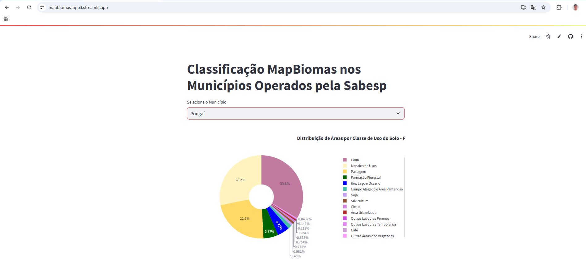
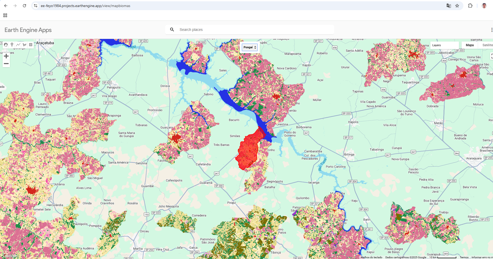

<html lang="pt-BR">
<head>
    <meta charset="UTF-8">
    <meta name="viewport" content="width=device-width, initial-scale=1.0">
    <title>Uso e Ocupação do Solo conforme Classificação Mapbiomas - Coleção 8.0 nos Município Operado pela Sabesp</title>
</head>
<body>
    <h1>Uso e Ocupação do Solo conforme Classificação Mapbiomas - Coleção 8.0 nos Município Operado pela Sabesp</h1>
    
Este projeto utiliza Streamlit para visualizar a classificação do uso e ocupação do solo por município operado pela Sabesp. Os dados são carregados de dados e arquivos vetoriais e exibidos em um gráfico de pizza interativo.

    
O dashboard pode ser visto em:

    
<a href="https://mapbiomas-app3.streamlit.app/">https://mapbiomas-app3.streamlit.app/</a>

    

    <h2>Requisitos</h2>
    
Certifique-se de ter os seguintes pacotes instalados:

    <ul>
        <li>streamlit</li>
        <li>pandas</li>
        <li>plotly</li>
        <li>openpyxl</li>
    </ul>
    
Abra contas (gratuitas para este volume de publicação):

    <ul>
        <li>Git HUB</li>
        <li>Streamlit</li>
    </ul>
    
Você pode instalar todos os pacotes necessários usando o comando <code>!pip install</code>:

    <ul>
        <li>!pip install streamlit</li>
        <li>!pip install pandas</li>
        <li>!pip install plotly</li>
        <li>!pip install openpyxl</li>
    </ul>

    <h2>Passos</h2>
    <ol>
        <li>Faça o clone do repositório no Git HUB para submeter os arquivos necessários para fazer o deploy da aplicação, a base de dados para Classificações dos Municípios, a lista de requirements.txt (pacotes), o arquivo escrito em Python necessário para criar uma lista suspensa para seleção das labels dos municípios para gerar os gráficos.</li>
        <li>Adicione uma nova origem remota ao repositório local.</li>
        <li>Para toda alteração dos arquivos no desktop será necessário um Commit para atualização dos dados no Git HUB com Branch Upstream.</li>
        <li>Defina uma mensagem de commit como "Atualizando arquivos para Deploy".</li>
        <li>Execute o script Streamlit no seu terminal bash com: <code>streamlit run app.py</code>.</li>
        <li>Adicione o <code>app.py</code> ao Git HUB.</li>
        <li>Faça um push das alterações do desktop para o repositório remoto.</li>
        <li>O Dashboard depois de dar um run <code>streamlit app.py</code> aparecerá em local server como uma página do Streamlit, na página do Streamlit inicie novo app em "New App".</li>
        <li>Preeencha as informações do repositório, branch, app utilizado e caminho do arquivo.</li>
        <li>Deploy!</li>
    </ol>

    <h2>Estrutura do Projeto</h2>
    
Arquivos vetoriais e de dados contendo os dados de uso e ocupação do solo.

    
<code>app.py</code>: Script principal que carrega os dados, processa e exibe o gráfico de pizza.

    <h3>Funcionalidades:</h3>
    <ul>
        <li>Carrega dados de uma base de dados.</li>
        <li>Preenche as classificações vazias com "0".</li>
        <li>Exibe uma lista suspensa para selecionar o município.</li>
        <li>Gera um gráfico de pizza interativo mostrando a classificação do uso e ocupação do solo.</li>
        <li>Exibe as áreas por classe como uma lista.</li>
    </ul>

    <h3>Exemplo de Uso</h3>
    
Selecione um município na lista suspensa.

    
Veja o gráfico de pizza atualizado com os dados do município selecionado.

    <h2>Extração de Dados da Coleção 8 do MapBiomas</h2>
    
Este projeto também inclui uma aplicação para extração de dados da Coleção 8 do MapBiomas usando o Google Earth Engine (GEE). A Coleção 8 do MapBiomas fornece mapas anuais de cobertura e uso da terra no Brasil entre 1985 e 2023.

    
<a href="https://ee-feyo1984.projects.earthengine.app/view/mapbiomas">https://ee-feyo1984.projects.earthengine.app/view/mapbiomas</a>

    

    
Execute o Script de Extração: Utilize o script fornecido pelo MapBiomas para extrair os dados desejados. O script pode ser encontrado no repositório do MapBiomas no GEE.

    
Exemplo de Script

    <h3>Recursos Adicionais</h3>
    
Documentação Oficial do MapBiomas: Acesse a documentação oficial para tutoriais e exemplos de uso.

    
Este README atualizado inclui uma seção sobre a aplicação de extração de dados da Coleção 8 do MapBiomas usando o Google Earth Engine, com instruções detalhadas e um exemplo de script. Se precisar de mais alguma coisa, estou aqui para ajudar!

Criado pela Superintendência de Engenharia de Inovação, editado por Fernando Yogi.

</body>
</html>
